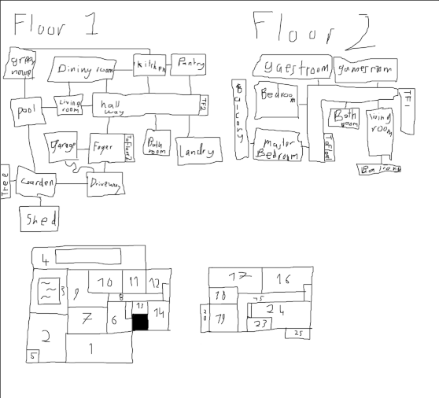
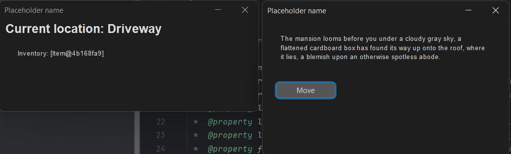
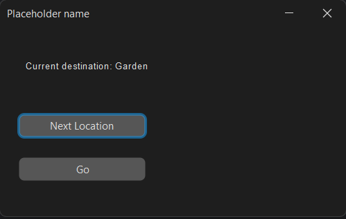
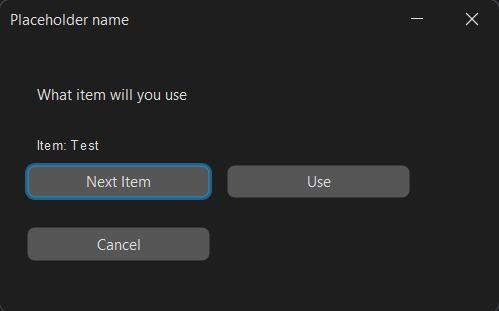
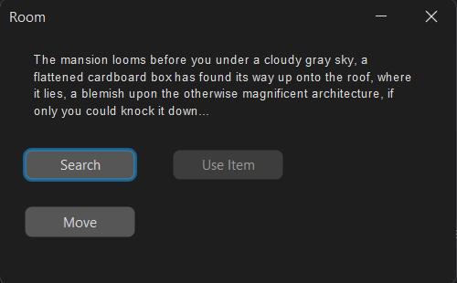
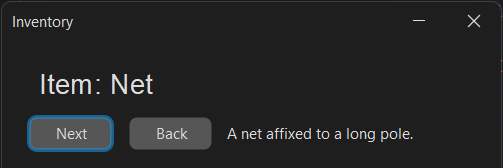
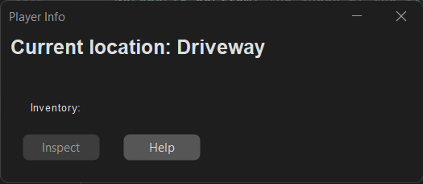
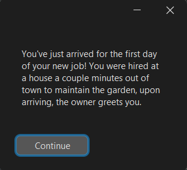
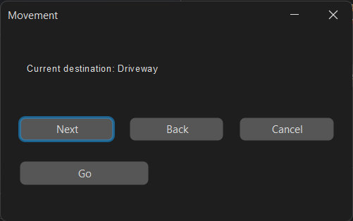

# Development Log

The development log captures key moments in your application development:

- **Design ideas / notes** for features, UI, etc.
- **Key features** completed and working
- **Interesting bugs** and how you overcame them
- **Significant changes** to your design
- Etc.

---

## Date: 22/04/2026

Made s layout for the game area.

---

## Date: 22/04/2026

First Windows are created, this includes a main window that shows the player's current location and inventory. currently the items in the inventory don't display properly, and I also want to change the way the list is printed to make it look nicer.

---

## Date: 24/04/2026

Added a new window so that the player can move.

---

## Date: 29/04/2026

Added a lock system so that the player can't walk through some doors.

---

## Date: 01/05/2026

Added a window that appears when a locked door is encountered, this allows you to choose a key from your inventory.

---

## Date: 04/05/2026

Filled in all of the variables required for the game to run.

---

## Date: 06/05/2026

Added the ability to find items.

---

## Date: 06/05/2026

Added the ability to inspect items

---

## Date: 06/05/2026

Added win conditions, a tutorial, and an intro.

---

## Date: 07/05/2026

Changed all selection screens to be more user-friendly.

---