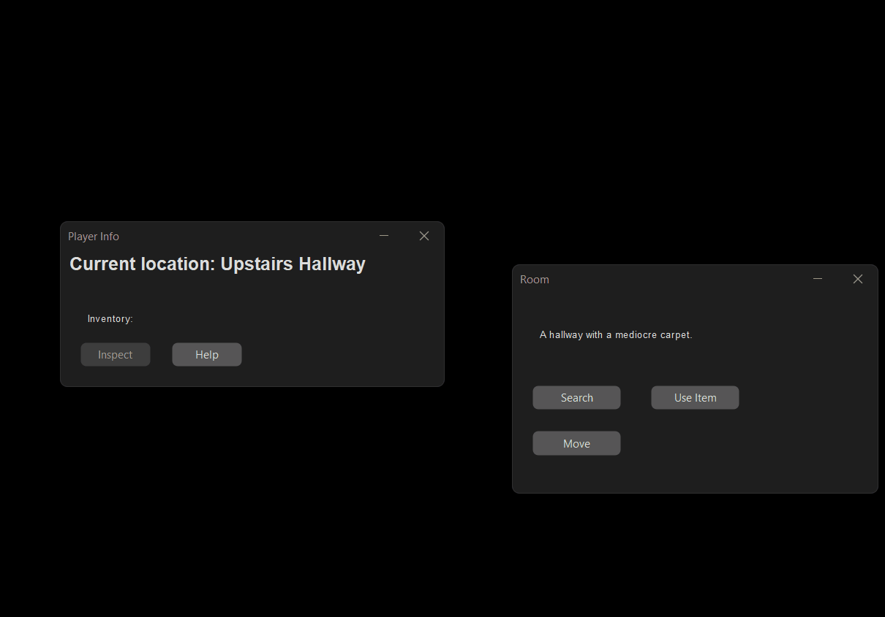
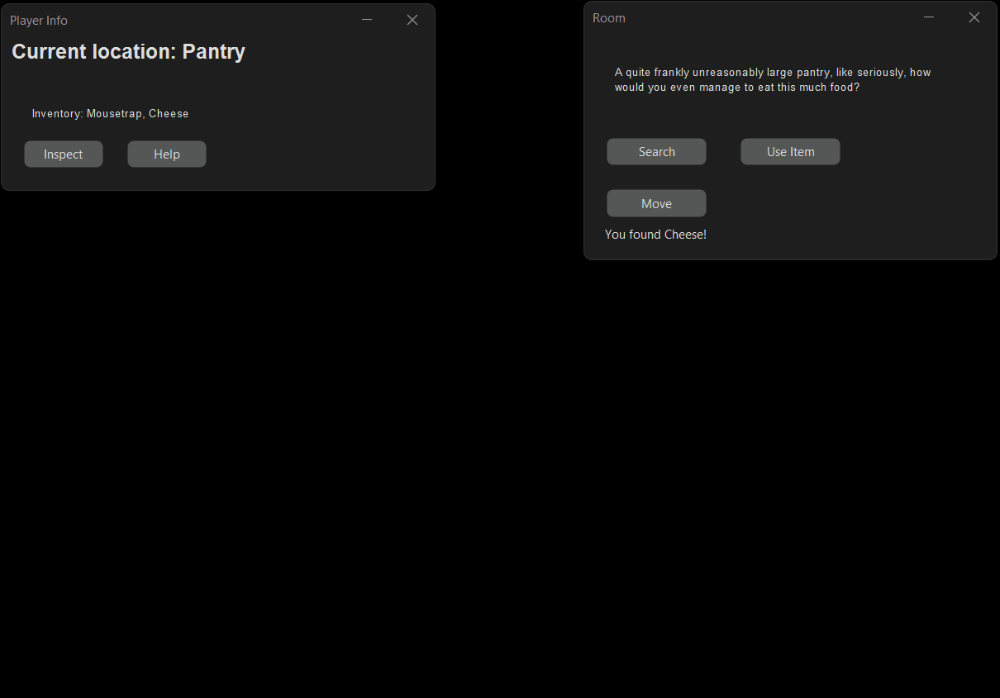
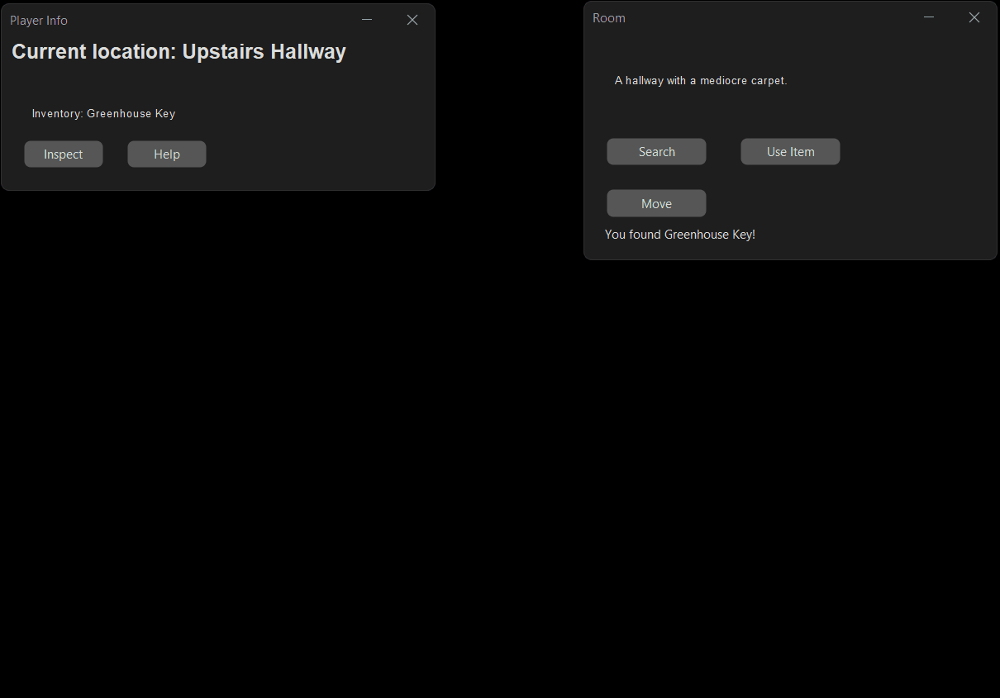
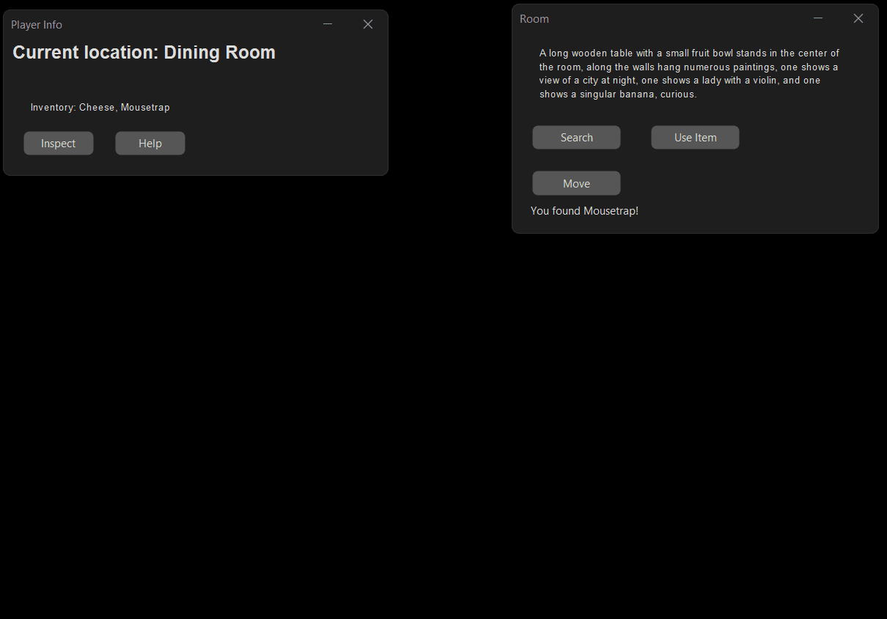
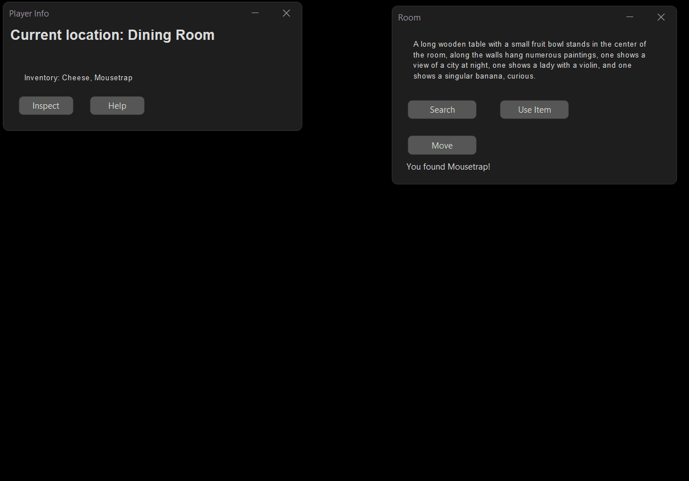
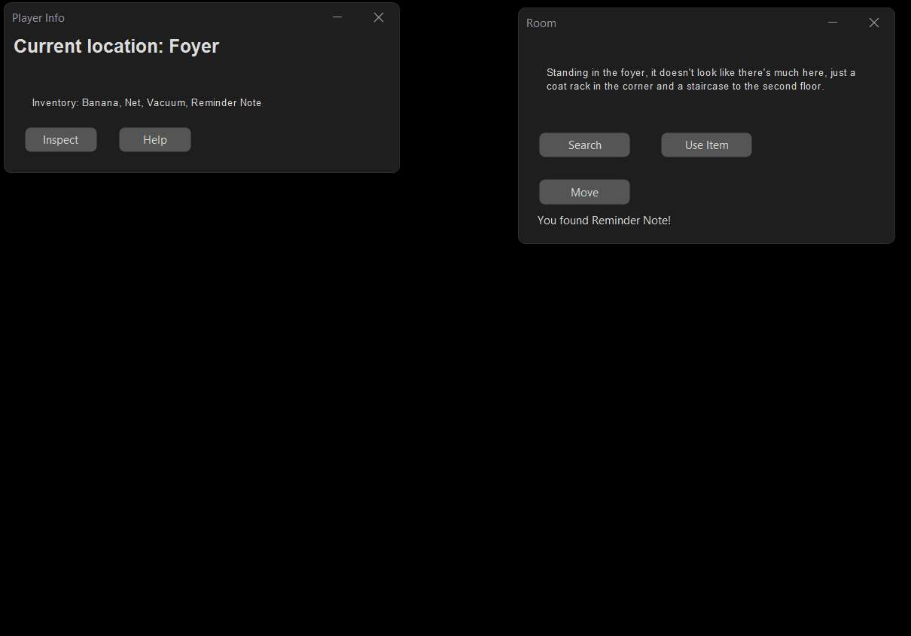
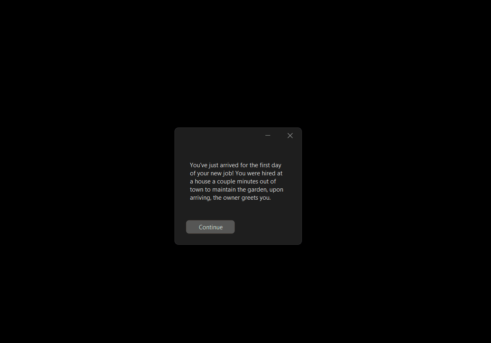
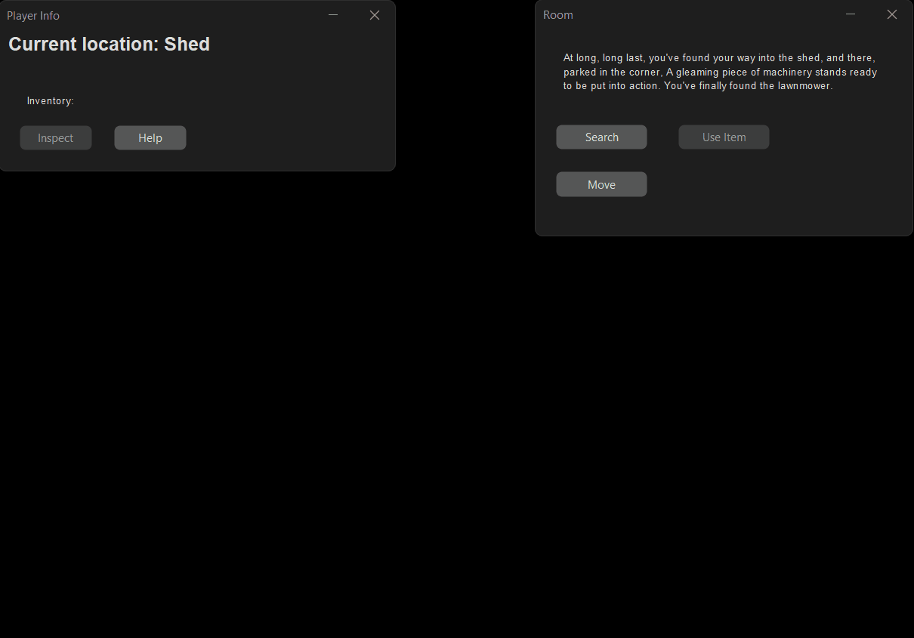
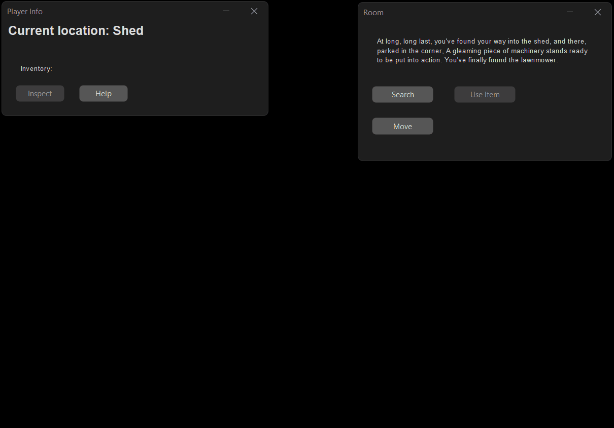

# Results of Testing

The test results show the actual outcome of the testing, following the [Test Plan](test-plan.md)

---

## Testing movement (Valid)

I need to make sure that the player can move seamlessly from room to room.

### Test Data To Use

Enter and exit every room.

### Test Result

When I tried to move into the games room, the buttons were disabled and I was unable to progress, it turns I forgot to add it to the list of rooms, this is now fixed.

---

## Testing if keys work (valid)

Players should be able to unlock doors and collect items by using the correct keys.

### Test Data To Use

Play through the game, make sure that every lock accepts the corresponding key.

### Test Result

initially there were some typos that meant some keys didn't work, but once I fixed those the system worked as intended.

---

## Testing the wrong key (invalid)

When using the wrong key, the program should tell you and not let you in.

### Test Data To Use

Use an incorrect item on a door.

### Test Result

The wring key message appears as intended.

---

## Testing the last key in your inventory (Boundary)

When unlocking multiple locks on a single door, each item you use is deleted, if you select and use the last item on your list, it will be deleted, which may cause problems.

### Test Data To Use

Go to a door with multiple locks and use the last item in your inventory to unlock one of them.

### Test Result

When using the last item in a list with more locks left to go, the key selector will get stuck on the item you just used, which is no longer in your inventory, to fix this I added a check to make sure you're not out of bounds, and if it comes back true you will be put back in bounds.

---

## scrolling down/up from the first/last item in the list (Boundary)

When you're selecting an item in a list, you have the option to view the next/previous item in the list, using these controls at the end of the list to go out of bounds could be problematic.

### Test Data To Use

Select the previous item on the first item in the list and the next item on the last item in the list.

### Test Result

The game loops as intended.

---

## Reaching the end of a dialogue list (Boundary)

Once you read the final line of dialogue in the list and press next, instead of looking for another line of dialogue it should close the window.

### Test Data To Use

Run through the intro.

### Test Result

The game starts as intended.

---

## Winning the game ()

Once you collect the lawnmower, the lawn should change its lock to allow you to use it as an item which wins the game.

### Test Data To Use

Grab the lawnmower from the shed and use it on the lawn

### Test Result

At first this didn't work, because the if statement that checked if you were collecting the lawnmower checked after the slot containing the lawnmower had already been emptied, meaning it didn't return true, I fixed this by checking the slot earlier, and now the game is beatable.

---